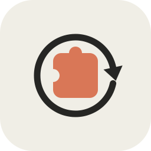

<div align="center">



# CC Skill

**One place to manage AI Agent SKILLs across Claude Code, Codex, OpenClaw, ZCode, Qoder and more.**

Scan · Preview · Edit · Install (copy or link) · De-duplicate · Project scopes · WebDAV backup

[中文文档](README.md) · [Report Bug](../../issues) · [Request Feature](../../issues)


</div>

---

CC Skill is a native desktop app (Electron, zero runtime deps in UI) that gives you a single pane of glass over the SKILL folders that different AI CLIs read. Stop copy-pasting the same `SKILL.md` folder into five different directories — keep **one physical copy** and share it everywhere.

## Why

Every AI CLI reads its own skills directory:

| Agent       | Default directory                        |
| ----------- | ---------------------------------------- |
| Claude Code | `~/.claude/skills`                       |
| Codex       | `~/.codex/skills`                        |
| OpenClaw    | `~/.openclaw/skills`                     |
| ZCode       | `~/.zcode/skills`                        |
| Qoder       | `~/.qoder/skills`                        |
| (shared)    | `~/.agents/skills`                       |

Installing one SKILL for every agent means N divergent copies. CC Skill fixes this with **copy or junction-link installs**, duplicate merging, project scopes and WebDAV backup.

## Features

- 🔍 **Unified scan** — discovers SKILLs across all configured agent directories (folder skills and flat `.md` files), with per-agent counts
- 📄 **Detail view** — markdown preview, raw editor, file list
- 📦 **Install anywhere** — copy a SKILL to any agent, or create a **directory junction** so every agent shares one physical copy (edits apply everywhere instantly)
- 🔗 **Link management** — each SKILL detail lists its installed links; view / open / uninstall / add new
- 🧹 **Merge duplicates** — finds the same SKILL copied into multiple directories and collapses them into "1 canonical copy + N links" (safe delete to Recycle Bin, retry & copy-fallback built in)
- 🗂 **Project scopes** — register project folders (e.g. `your-repo/.claude/skills`) and move SKILLs between global and project scopes; project installs always use copies (git-safe)
- 📊 **Dashboard** — counts, per-agent / per-project distribution, recent activity
- ☁️ **WebDAV backup & restore** — bring your own server (坚果云 / Nextcloud / Alist …), one-click snapshot of every physical SKILL, restore to the same directories on any machine
- 🧾 **Operation log** — every action is recorded in-app and appended to `cc-skill.log` next to the app

## Getting started

```bash
git clone https://github.com/kaamil95/cc-skill.git
cd cc-skill
npm install            # in China: ELECTRON_MIRROR=https://npmmirror.com/mirrors/electron/ helps
npm start              # dev run
npm run dist           # portable exe (dist/CC Skill <version>.exe)
```

Requirements: Windows 10+ (junction-based linking is NTFS), Node.js 18+.

> Prebuilt portable exe is attached to each [Release](../../releases).

## How it works

- **Copy install** — plain recursive copy into the target agent directory.
- **Link install** — creates an NTFS **junction** (`fs.symlinkSync(target, dest, 'junction')`) inside the target agent directory pointing at the canonical copy. No admin rights needed, same disk only. Deleting a link never touches the canonical copy; deleting a canonical copy warns about depending links; dangling links are detected and safe to clean.
- **Project scopes** — scans `<project>/.claude|.agents|.zcode|.codex|.qoder/skills`. Project installs are always **copies** (junctions inside git repos risk accidental commits).
- **WebDAV backup** — zips `manifest.json` + every physical SKILL and PUTs it to your server; restore downloads the latest snapshot and overlays it back onto the recorded directories.

## WebDAV setup

Settings → WebDAV:

| Field      | Example                          |
| ---------- | -------------------------------- |
| Server URL | `https://dav.jianguoyun.com/dav/`|
| Username   | your account                     |
| Password   | app-specific password            |
| Remote dir | `/CC Skill`                      |

Test connection → Backup now → Restore latest. The WebDAV protocol subset used is `PROPFIND / MKCOL / PUT / GET`, so any standards-compliant server works.

## FAQ

**Is it Mac/Linux compatible?**
The UI runs anywhere Electron runs, but linking relies on NTFS junctions. PRs for `symlink` support on unix are welcome.

**Where is my data?**
Config: `%APPDATA%\cc-skill\config.json`. Log: next to the exe (portable) or project root (dev). CC Skill never deletes anything permanently — removals go to the Recycle Bin.

**Is my WebDAV password safe?**
It is stored in the local config file in plain text (same as most similar tools). Use an app-specific password and keep the config file private.

## Roadmap

- [ ] Scheduled / auto backup
- [ ] macOS & Linux symlink support
- [ ] SKILL marketplace / one-click install from Git
- [ ] Multi-language UI

## Contributing

Issues and PRs are welcome — see [CONTRIBUTING.md](CONTRIBUTING.md). Please read our [Code of Conduct](CODE_OF_CONDUCT.md).

## License

[MIT](LICENSE)
