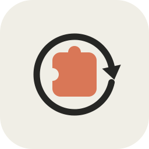

<div align="center">



# CC Skill

**One place to manage AI Agent SKILLs across Claude Code, Codex, OpenClaw, ZCode, Qoder and more.**

Scan · Preview · Edit · Install (copy or link) · De-duplicate · Project scopes · WebDAV backup

[中文文档](README.md) · [Report Bug](../../issues) · [Request Feature](../../issues)


</div>

---

CC Skill is a native desktop app (Electron, zero runtime deps in UI) that gives you a single pane of glass over the SKILL folders that different AI CLIs read. Stop copy-pasting the same `SKILL.md` folder into five different directories — keep **one physical copy** and share it everywhere.

## Why

Every AI CLI reads its own skills directory:

| Agent       | Default directory                        |
| ----------- | ---------------------------------------- |
| Claude Code | `~/.claude/skills`                       |
| Codex       | `~/.codex/skills`                        |
| OpenClaw    | `~/.openclaw/skills`                     |
| ZCode       | `~/.zcode/skills`                        |
| Qoder       | `~/.qoder/skills`                        |
| (shared)    | `~/.agents/skills`                       |

Installing one SKILL for every agent means N divergent copies. CC Skill fixes this with **copy or junction-link installs**, duplicate merging, project scopes and WebDAV backup.

## Features

- 🔍 **Unified scan** — discovers SKILLs across all configured agent directories (folder skills and flat `.md` files), with per-agent counts
- 📄 **Detail view** — markdown preview, raw editor, file list
- 📦 **Install anywhere** — copy a SKILL to any agent, or create a **directory junction** so every agent shares one physical copy (edits apply everywhere instantly)
- 🔗 **Link management** — each SKILL detail lists its installed links; view / open / uninstall / add new
- 🧹 **Merge duplicates** — finds the same SKILL copied into multiple directories and collapses them into "1 canonical copy + N links" (safe delete to Recycle Bin, retry & copy-fallback built in)
- 🗂 **Project scopes** — register project folders (e.g. `your-repo/.claude/skills`) and move SKILLs between global and project scopes; project installs always use copies (git-safe)
- 📊 **Dashboard** — counts, per-agent / per-project distribution, recent activity; missing skill directories are named right on their chips, and the dashboard's "N directories missing" count clicks through to the agent's view
- ☁️ **WebDAV backup & restore** — bring your own server (坚果云 / Nextcloud / Alist …), one-click snapshot of every physical SKILL, restore to the same directories on any machine
- 🖥️ **Machine identity & profiles** — the cloud keeps one folder per machine, so how many backups each one has is plain to see; restore / rename / claim / delete a machine. After a fresh OS install, tick "this is this computer" in the restore dialog and project entries plus the project skills under them come back too. Configs can be exported to a file and imported from one
- 🧾 **Operation log** — every action is recorded in-app and appended to `cc-skill.log` next to the app

## Getting started

```bash
git clone https://github.com/kaamil95/cc-skill.git
cd cc-skill
npm install            # in China: ELECTRON_MIRROR=https://npmmirror.com/mirrors/electron/ helps
npm start              # dev run
npm run dist           # portable exe (dist/CC Skill <version>.exe)
```

Requirements: Windows 10+ (junction-based linking is NTFS) or macOS 12+, Node.js 22+ (for development and testing; the app itself runs on Electron's bundled Node).

> Prebuilt portable exe is attached to each [Release](../../releases).

## How it works

- **Copy install** — plain recursive copy into the target agent directory.
- **Link install** — creates an NTFS **junction** (`fs.symlinkSync(target, dest, 'junction')`) inside the target agent directory pointing at the canonical copy. No admin rights needed, same disk only. Deleting a link never touches the canonical copy; deleting a canonical copy warns about depending links; dangling links are detected and safe to clean.
- **Project scopes** — scans `<project>/.claude|.agents|.zcode|.codex|.qoder/skills`. Project installs are always **copies** (junctions inside git repos risk accidental commits).
- **WebDAV backup** — zips `manifest.json` + every physical SKILL and PUTs it into this machine's folder in the cloud (one folder per machine); restore picks any machine and any of its snapshots, and overlays it back onto the recorded directories.

## WebDAV setup

Settings → WebDAV:

| Field      | Example                          |
| ---------- | -------------------------------- |
| Server URL | `https://dav.jianguoyun.com/dav/`|
| Username   | your account                     |
| Password   | app-specific password            |

Test connection → Upload to cloud → Download from cloud. **Saving the config also registers this machine in the cloud** — a freshly configured machine appears in the other machines' lists before its first backup. "Download from cloud" restores this machine's latest backup; when this machine has none, the machine list opens so you can pick one. The machine's own row in **Cloud machine profiles** also keeps a permanent "Back Up Now". The WebDAV protocol subset used is `PROPFIND / MKCOL / PUT / GET`, so any standards-compliant server works.

### Several machines, one cloud folder

The cloud is **organised per machine**: the root is fixed at `cc-skill-sync` (no remote-directory field in the UI anymore), with one subdirectory per machine under it, named after the machine plus its full id — `kai-pc-8c2f1d4e-1a2b-4c3d-9e8f-0123456789ab`:

```
cc-skill-sync/
  kai-pc-8c2f1d4e-1a2b-4c3d-9e8f-0123456789ab/
    machine.json                       who this machine is (renaming rewrites this, not the folder)
    cc-skill-backup-20261001-022130.zip
    cc-skill-backup-20261001-022130.zip.json   what is inside that one
  old-mbp-3d7a1b90-2c4e-4f61-8a55-9b0c1d2e3f40/
    ...
```

So which backup belongs to whom no longer has to be guessed: how many backups a machine has, and whose they are, is readable from the folders. Each machine keeps its own last 10 — another machine backing up often cannot squeeze yours out.

Restore from any machine, and from any of its backups: open a machine in **Cloud machine profiles** to see every copy it holds (time / size / skill count) and pick one. **Restoring another machine's backup brings back global skills only** — project paths are machine-specific, and a set of paths restored from elsewhere is mostly wrong; restoring this machine's own backup brings the project-level skills back too.

Each machine has a random `machineId` in its `config.json`, and the tail of the folder name is exactly that. A fresh OS install wipes that config, mints a new id, and the machine stops recognising its own backups — tick **"this is this computer"** in the restore dialog and the id is claimed back, project entries and the project skills under them come back with it, and later backups keep going to the original folder.

The identity is deliberately **not** inferred from hardware: a clean reinstall regenerates the OS-level fingerprints anyway (registry `MachineGuid`, volume serial), and the hardware serials that survive it are the ones that collide between identically bought machines — and mistaking two machines for one fails silently, which is far worse than the reverse.

Settings → Machine & config lets you rename machines (your own name travels with the backup; names you give other machines stay local), reset the id, and manage **cloud machine profiles** (restore / rename / claim / delete a machine — deleting takes its whole folder with every backup in it, permanently, and the confirmation states how many). Configs can also be exported to JSON and imported back.

**The restore range is decided by this machine, not by the archive.** Files are only written into directories your own config uses, or into the extra ones you confirm from a list during the restore; what the archive declares about itself does not count — `~` form included (that is where `.ssh` and friends live). Project-level skills have one more gate: the destination must be a skill directory under a project **this machine has registered** — the archive saying which project it belongs to is not enough. Paths containing `..`, or that are neither absolute nor `~` form, are dropped as malformed.

**Archives do not contain your WebDAV password** (address and username do travel with them): the archive sits in the cloud and may be shared around, while restoring already requires reaching that cloud — so the credentials are in your local config anyway. Restoring a backup whose address or username differs from yours clears the local password and asks you to retype it; if the address is unchanged, nothing is cleared.

## FAQ

**Is it Mac/Linux compatible?**
macOS 12+ is supported: linking uses the system `symlink` and a dmg ships with each [Release](../../releases). Linux's symlink logic is in place and the code runs, but there is no packaged build yet — PRs welcome.

**Where is my data?**
Windows portable: config and log both live next to the exe (copy the whole folder and you are done; an old `%APPDATA%` config is migrated on first launch). macOS: `~/Library/Application Support/CC Skill/`. Tests / multiple instances can point `CC_SKILL_DATA_DIR` elsewhere. Local files are never deleted permanently — removals go to the Recycle Bin; **cloud backups are** (WebDAV has no recycle bin), which is why deleting a backup, or a whole machine, from "Cloud machine profiles" states how many it will take in its confirmation.

**Is my WebDAV password safe?**
It is stored in the local config file in plain text (same as most similar tools). Use an app-specific password and keep the config file private.

## Roadmap

Done:

- [x] Scheduled / auto backup — startup / daily / weekly, and it only uploads when the content actually changed
- [x] macOS symlink support — a dmg ships with each Release; Windows keeps using junctions
- [x] SKILL marketplace / one-click install from Git — Discover: search repositories, paste links, load an index
- [x] Multi-language UI — 中文 / English, following the system or picked manually

Next:

- [ ] One-click SKILL updates: remember where each installed-from-Discover SKILL came from and at what version, check for updates in one click
- [ ] Linux packaging (AppImage / deb) — the symlink logic is ready; only the packaged build is missing
- [ ] Diff before merge / restore: see what changes before collapsing duplicates or restoring a backup
- [ ] Backup encryption: if the WebDAV folder is ever shared, the archive contents stay unreadable
- [ ] More cloud backends: local folder / GitHub repository / S3, not just WebDAV

## Contributing

Issues and PRs are welcome — see [CONTRIBUTING.md](CONTRIBUTING.md). Please read our [Code of Conduct](CODE_OF_CONDUCT.md).

## License

[MIT](LICENSE)
