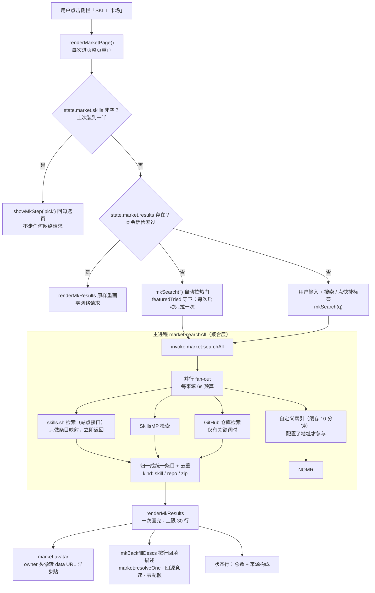
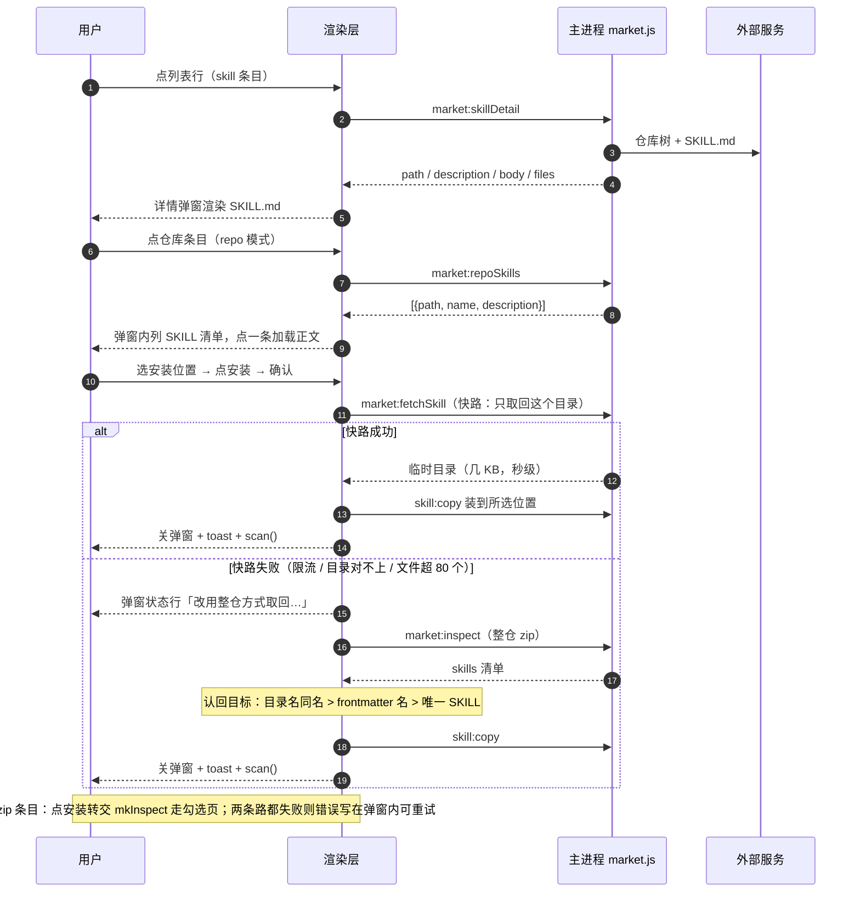
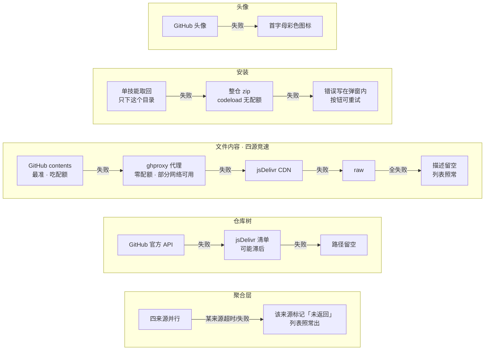

# SKILL 市场数据加载逻辑详解

> 适用版本：v0.0.3+（2026-10 聚合检索改版后）。行号为写作时的近似位置，以函数名为准。
> 本文回答：点开侧栏「SKILL 市场」的那一刻，数据从哪来、什么时机来、走哪些缓存、失败怎么退化。

---

## 0. 一图流：进入市场页后发生什么

## 1. 角色与文件

| 文件 | 职责 |
| --- | --- |
| `renderer/app.js` | 页面状态机 + 渲染。市场函数集中在 `SKILL 市场（侧栏页）` 注释块下：`renderMarketPage` / `defaultMkState` / `bindMarketPage` / `mkSearch` / `renderMkResults` / `mkOpenDetail` / `loadSkillBody` / `renderRepoSkillList` / `mkInstallDetail` 等 |
| `renderer/preload.js` | `window.api.invoke(channel, payload)` 白名单转发（`ipc-channels.js` 定义通道清单） |
| `src/ipc.js` | 主进程 IPC handler 注册；市场通道集中在 `market:*` 一节 |
| `src/market.js` | 市场数据层：聚合检索 `searchAll`、各来源适配器、仓库树定位、文件取回、头像、缓存与熔断 |
| `src/net.js` | 统一 HTTP 出口。Electron 启动时注入 `net.fetch`（走 Chromium 网络栈 → 认代理设置）；测试注入假实现离线跑 |
| `src/paths.js` | `TEMP_DIR_RE` 管临时目录命名与启动清扫（`cc-skill-import-*` / `cc-skill-fetch-*`） |

**核心纪律：网络只发生在主进程。** 渲染层只发 IPC，不知道任何 URL；token 只发给 GitHub 域（`ghHeaders`），绝不带给 skills.sh / skillsmp / 索引站。

## 2. 进入页面的时机与状态恢复（`renderMarketPage`）

市场页与总览同模式：**每次进入都整页重画**。重画时按顺序做四件事：

1. **初始化状态**（`defaultMkState`）：一个搜索框搜所有来源，不再区分「来源/站点」；localStorage 的旧键（`mk.src` / `mk.market`）不再读写，留着无害。
2. **渲染控制卡与结果区**：一个通栏搜索框（`#mk-query`）+ 快捷标签（`#mk-tags`）+ 可折叠的高级选项（`#mk-adv`：链接安装、GitHub Token、自定义索引地址）。链接安装（GitHub 仓库 / zip 直链）、Token、索引地址是一次性配置，不配占一排按钮。
3. **恢复步骤**：`state.market.skills` 非空（上次装到一半）→ 直接回勾选页；否则停在「找」。
4. **恢复结果**：`state.market.results` 还在（本次会话内）→ `renderMkResults` 原样重画列表，**不发任何网络请求**。

**热门自动加载**：`!m.results && !m.featuredTried` 时 `mkSearch('')` —— 无关键词 = 主进程用各站注册的 featured 查询词检索。有来源成功才落 `featuredTried`，全挂（断网）下次进页重试。

## 3. 来源注册表与快捷标签

`market:listBuiltin` 返回静态注册表 `BUILTIN_MARKETS`（src/market.js）：每个站点一份 `{ id, name, home, desc, featured: { query, tags } }`。改版后渲染层只用它的 **featured.tags 渲染快捷标签行**（合并去重）——站点胶囊和来源页签已删除；featured.query 在主进程 `searchAll` 里给无关键词检索用。

| 站点 | 检索接口 | 自带字段 |
| --- | --- | --- |
| skills.sh | `https://www.skills.sh/api/search?q=…` | name / installs / skillId / source —— 无描述无路径，靠仓库树解析 |
| SkillsMP | `https://skillsmp.com/api/v1/skills/search?q=…&sortBy=stars` | name / description / stars / author / githubUrl（自带路径） |

注册表是唯一的扩展点：有公开检索 API 且 SKILL 落在 GitHub 的站才能登记。

## 4. 一次聚合检索的完整链路（`searchAll`）

主进程 `market.searchAll(q, { token, indexUrl, budgetMs })`：

1. **并行 fan-out**，每来源独立 6s 预算（`SEARCH_BUDGET_MS`），**只调站点接口，不碰 GitHub 配额**：
   - **skills.sh**：站方接口 → 条目只有 name/installs/skillId/source（实测无描述字段）。只做条目映射并立即返回 —— 描述不阻塞列表。
   - **SkillsMP**：站方接口自带描述与路径，零额外请求。
   - **GitHub 仓库检索**：仅有关键词时参与；`api.github.com/search/repositories`，仓库级条目（`kind: 'repo'`）。
   - **自定义索引**：配置了 indexUrl 才参与；`fetchIndexCached` 缓存 10 分钟，别每次检索都重拉。
   - 单来源超时/失败**不拖垮整体**：runSource 捕获一切，来源小结标记 `未返回`。
2. **归一**（`toUnified` / `toUnifiedRepo`）：所有条目统一为
   `{ kind: 'skill' \| 'repo' \| 'zip', name, description, owner, repo, skillId, path, ref, installs, stars, tags, srcId, srcName, source }`。
   `source` 保留原始来源描述，链接安装（mkInspect）与「在 GitHub 查看」靠它工作。
3. **去重**：SKILL 条目按 `owner/repo + (path || skillId)` 识别同一技能；仓库条目若与某个 SKILL 条目同仓则不重复展示（那个 SKILL 的详情弹窗里能看到全仓清单）。
4. 返回 `{ ok, items, sources }`：`items` 是 SKILL 在前、仓库在后的统一列表；`sources` 是每来源小结 `{ id, name, ok, count, error }`。

**为什么列表只等站点接口**：skills.sh 的检索接口没有描述字段（实测确认），描述只能从 GitHub 拿 —— 而在你的网络下 GitHub 链路既慢又不稳定。让列表只等站点接口（~1-2s），描述由回填负责，两条路各自尽力。

## 4.5 渲染与描述回填

- **列表行**：统一模板 `mkRowHtml`：彩色首字母图标（`--h` 色相由名字哈希）+ owner 头像图层 + 名称 + 仓库徽章 + 来源徽章（`srcName`）+ 描述一行 + 右侧指标与安装按钮。
- **分区**：SKILL 行在前、仓库行在后，之间插 `mk-row-kind` 分隔行「相关仓库（整仓安装）」。
- **描述回填**（`mkBackfillDescs`）：列表渲染后启动，只补可见 30 行里没有描述的 skill 条目；并发 6，逐行调 `market:resolveOne`（主进程 `resolveEntry`：树定位 + SKILL.md，skillCache 缓存 24h）。拿到就改对应行的文字（行高固定，无布局跳动）；新检索发起后 seq 对不上号，迟到的回填自动作废。
- **内容四源竞速**（`readRawBytes`）：同一文件并发取 GitHub contents（最准，吃配额）/ jsDelivr CDN / ghproxy.net 代理 / raw，谁先到用谁；**赢家记为首选源**，之后直取首选一次成功。健康网络自动锁进官方接口，raw/CDN 被墙的网络自动锁进代理源 —— **全程零配置，不需要用户填 Token**。ghproxy 是第三方代理，token 纪律照旧（ghHeaders 只认 GitHub 域名）。
- **头像**：行画完后异步 `market:avatar` → `ownerAvatar` 拉 `github.com/{owner}.png` 转 data URL（CSP 只放行 data:），6s 超时 + 失败按会话负缓存。
- **状态行**：`共 {n} 个，显示前 {m} 个 · skills.sh ×24 · SkillsMP ×8 · GitHub ×5`，谁没回来一眼可见。
- **上限 30 行**（`MK_LIST_MAX`）。

## 6. 详情弹窗与安装链路

**点列表行 → 应用内详情弹窗**（`mkOpenDetail`，不跳浏览器），三种条目三种模式：

| kind | 弹窗行为 |
| --- | --- |
| `skill` | 渲染已知信息后 `market:skillDetail` 拉正文与文件清单（`loadSkillBody`）；底部「安装到」picker + 「安装」按钮 + 「在 GitHub 查看」 |
| `repo` | 先隐藏安装按钮，`market:repoSkills` 列出仓库里全部 SKILL（树定位 + 描述解析，上限 20 个）；点一条 → `loadSkillBody` 加载该 SKILL 的正文，安装按钮出现，之后的安装流程与 skill 模式完全一致 |
| `zip` | 正文区说明安装方式；点「安装」→ 关弹窗 → `mkInspect` 转交链接安装流程（勾选页：选位置 → 确认 → 复制） |

**skill / repo 模式点「安装」→ 确认弹窗 → `mkInstallDetail`**：

1. **快路**：`market:fetchSkill` —— 按仓库树清单只取回这一个 SKILL 的目录（几 KB 秒级）。成功 → `skill:copy` 装到所选位置 → 关弹窗 + toast + `scan()`。
2. **慢路（回退）**：快路失败（限流/目录对不上/文件超 80 个）→ 人留在弹窗里，状态行显示「改用整仓方式取回…」→ `market:inspect` 整仓 zip → 按「目录名同名 > frontmatter 名（排除仓库根）> 唯一 SKILL」认回目标 → `skill:copy`。装完自动关弹窗。
3. 两条路都失败：错误写在弹窗内（不关弹窗），按钮恢复可重试。

## 7. 缓存一览

| 缓存 | 位置 | Key | TTL / 上限 | 作用 |
| --- | --- | --- | --- | --- |
| 仓库树 | 主进程 `treeCache` | owner/repo | 30 分钟 / 120 仓 | 同仓库多个 SKILL 共用一次树请求 |
| SKILL 解析 | 主进程 `skillCache` | owner/repo/skillId | 24 小时 / 500 条 | 描述、路径一次解析，重复搜索零请求 |
| 自定义索引 | 主进程 `indexCache` | url | 10 分钟 / 20 条 | 聚合检索不重复拉索引 |
| 头像 | 主进程 `avatarCache` | owner | 会话级 / 300 个 | 重复渲染不再拉头像 |
| 检索结果 | 渲染层 `state.market.results` | — | 会话级 | 切页返回不重复检索；重画免请求 |
| featuredTried | 渲染层 `state.market` | — | 会话级 | 热门自动加载每次启动只拉一次 |
| 源熔断 | 主进程 `sourceHealth` | cdn / raw | 10 分钟 | 连接级失败后停用该源；`resetSourceHealth()` 仅供测试清理 |
| 临时目录 | `%TEMP%` | cc-skill-fetch-<ts> / cc-skill-import-<ts> | 启动清扫（1h） | 取回的 SKILL 文件落这里，装完即弃 |

## 8. 竞态守卫

| 守卫 | 防什么 | 机制 |
| --- | --- | --- |
| `mkSearchSeq` | 热门自动加载与手动搜索并发覆盖 | 每次检索取号，返回时对号——不是最新发起的就丢弃 |
| `featuredTried` | 热门重复拉取 | 会话级开关 |
| `mkdCurrent` 对号 | 弹窗加载详情期间用户点了另一行 | 迟到的详情结果直接作废 |
| `mkdBodySeq` | 仓库模式里连续点不同 SKILL，正文串台 | 正文加载取号，迟到结果作废 |
| 回填 seq 对号 | 列表回填期间发起新检索 | 回填逐行对号，迟到的描述不写进新列表 |

## 8.5 拿不到数据时的退化阶梯

## 9. 已知限制

- **raw.githubusercontent.com 与 cdn.jsdelivr.net 在部分网络（如中国大陆）都不可达**（实测）：此环境下四源竞速会自动锁进能通的源（ghproxy 代理或 contents API），零配置可用。
- **GitHub 匿名 API 60 次/小时**：检索列表本身零配额消耗（站点接口 + 代理源）；配额只花在详情正文与安装上。Token 变成可选加速项，不再是必需品。
- **jsDelivr 的 @HEAD 清单可能滞后**：只当树接口的兜底，不当唯一依据；它列出的不存在文件会让单技能取回 404，此时自动退整仓。
- **描述回填上限 30 行**：只回填可见行；往回滚不到的条目没有描述，点进详情可见。
- **回填用的 ghproxy.net 是第三方公共代理**：只读展示用（描述/正文），安装内容走 codeload 直连 GitHub，不经代理。
- **仓库模式上限 20 个 SKILL**：超大仓库只列前 20 个。
- **ghproxy.net 若失效**：竞速自动落回其余源；公共代理的可用性不受我们控制，属已知风险。

## 10. 关键函数速查

| 需求 | 去哪看 |
| --- | --- |
| 页面状态机 / 状态恢复 | `renderer/app.js` `renderMarketPage` / `defaultMkState` / `showMkStep` |
| 聚合检索入口 / 竞态守卫 | `renderer/app.js` `mkSearch` / `mkSearchSeq` |
| 列表渲染 / 描述回填 / 标签 | `renderer/app.js` `renderMkResults` / `mkBackfillDescs` / `renderMkTags` |
| 详情弹窗（skill/repo/zip 三模式） | `renderer/app.js` `mkOpenDetail` / `mkDetailView` / `loadSkillBody` / `renderRepoSkillList` |
| 安装（快路+整仓回退） | `renderer/app.js` `mkInstallDetail` |
| 聚合层 / 归一 / 去重 | `src/market.js` `searchAll` / `toUnified` / `toUnifiedRepo` |
| 来源适配器 | `src/market.js` `searchSkillsSh` / `searchSkillsMp` / `searchGithub` / `fetchIndexCached` |
| 内容四源竞速 | `src/market.js` `readRawBytes` / `fetchVia` / `preferredContent` |
| 仓库 SKILL 清单 | `src/market.js` `repoSkills` |
| 仓库树 / 文件取回 / 头像 | `src/market.js` `repoTree` / `fetchSkillFiles` / `ownerAvatar` |
| IPC 通道清单 | `ipc-channels.js`（`market:*` 一节）+ `src/ipc.js` handler 注册 |
| 临时目录清扫规则 | `src/paths.js` `TEMP_DIR_RE` / `sweepStaleTempDirs` |
